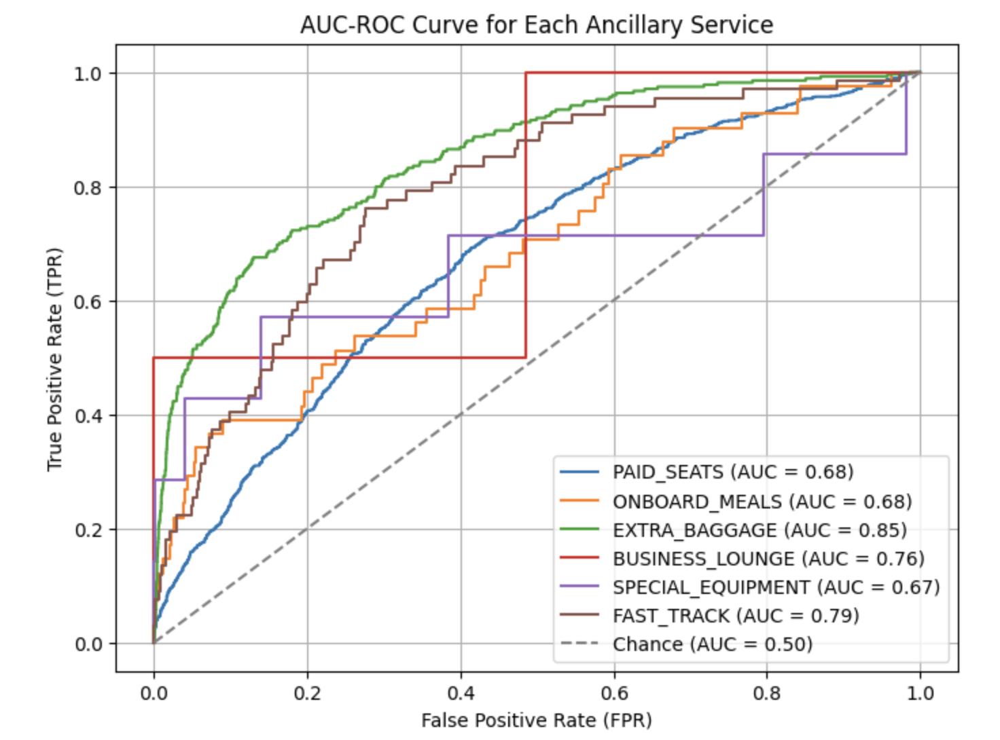

# PLL LOT
## Ancillary Services Recommendation

**Team Members**

| Full Name                   | Email                                |
|-----------------------------|--------------------------------------|
| Porimol Chandro             | p.chandro@student.uw.edu.p           |
| Anastasiia Sviridova        | a.sviridova@student.uw.edu.pl        |

Faculty of Economic Sciences, University of Warsaw

Source Code: [https://github.com/porimol/UB-LOT/blob/main/NCF-MLP.ipynb](https://github.com/porimol/UB-LOT/blob/main/NCF-MLP.ipynb)

## Table of Contents

- [Introduction](#introduction)
- [Business Idea](#business-idea)
- [Data Preprocessing](#data-preprocessing)
	- [Feature Engineering](#feature-engineering)
	- [Handle Missing Values](#handle-missing-values)
    - [Filling categorical columns missing values](#filling-categorical-columns-missing-values)
- [Data Visualization](#data-visualization)
	- [Descriptive Statistics](#descriptive-statistics)
	- [Visualize the class distribution of target variables](#visualize-the-class-distribution-of-target-variables)
	- [Visualize the distribution of days to departure](#visualize-the-distribution-of-days-to-departure)
	- [Visualize distribution of number of segments](#visualize-distribution-of-number-of-segments)
	- [Visualize correlations with heatmap](#visualize-correlations-with-heatmap)
- [Methodology](#methodology)
	- [Recommendation Architecture Diagram](#recommendation-architecture-diagram)
    - [Split into Train, Validation, and Test sets](#split-into-train-validation-and-test-sets)
    - [Building “NCF”-style MLP for multi-label Model](#building-ncf-style-mlp-for-multi-label-model)
- [Result Analysis](#result-analysis)
    - [AUC-ROC for each ancillary service](#auc-roc-for-each-ancillary-service)
    - [Confusion matrix for each ancillary service](#confusion-matrix-for-each-ancillary-service)
    - [Model Performance Matricies](#model-performance-matricies)
- [User Segmentation](#user-segmentation)
	- [Architecture Diagram](#architecture-diagram)
    - [User Distribution by Segment using KMean clustering](#user-distribution-by-segment-using-kmeans-clustering)
    - [User Distribution by Segment using GaussianMixture clustering](#user-distribution-by-segment-using-gaussianmixture-clustering)
- [Touchpoint-Based Ancillary Service Recommendations](#touchpoint-based-ancillary-service-recommendations)
- [Business Impact & Key Findings](#business-impact-key-findings)
- [Conclusion](#conclusion)

## Introduction

Airlines like LOT Polish Airlines continuously seek innovative ways to improve customer experience and increase revenue per passenger. One strategic area of focus is the recommendation of ancillary services — such as seat selection, extra baggage, onboard meals, lounge access, and fast track — during the passenger journey.

By leveraging historical data and customer behavior, we aim to develop a personalized recommendation system that proposes the right ancillary offers to the right customers, at the right moment in their journey (e.g. booking, check-in, post-trip). Such a system not only enhances customer satisfaction through personalization but also drives upselling opportunities and overall revenue.

## Business Idea

The goal is to implement a machine learning-based recommender system tailored to LOT’s users. Using anonymized historical data of ancillary purchases, we identify patterns in user preferences and cluster them into behavioral segments (e.g. Budget-Focused, Upsell-Prone).

By applying collaborative filtering and segmentation techniques, we optimize ancillary recommendations on LOT.com and the LOT App. This will support LOT in:

- Increasing ancillary conversion rates
- Offering dynamic personalization during the booking journey
- Targeting users with bundled or relevant premium offers
- Improving overall customer loyalty and experience

## Data Preprocessing

### Feature Engineering

To transform raw clickstream and booking data, filling missing activity counts and extracting OS names—into consistent, predictive features that machine‐learning models can understand. It also condenses high‐cardinality or sparse booking fields into usable variables, ensuring the model learns from the most informative, non‐null data.

### Handle Missing Values

Any NaN entries in the `PAGE`, `PAGE_VIEWS`, and `STAY_LENGTH` columns are replaced with 0. `PAGE`,`PAGE_VIEWS`, and `STAY_LENGTH` are numeric metrics that describe user behavior. A missing value typically indicates “no activity” rather than a truly unknown quantity, so imputing with 0 makes sense.

For every entry in the `OPERATING_SYSTEMS` column (which might look like "Windows 10 Pro", "macOS 11.2", or "Android 12"), only the first token (everything before the first space). Example: "Windows", "macOS", "Android"—is kept.

**Define Initial List of Numerical Columns:** A set of columns intended to be treated as categorical features.
**Define Columns to Exclude Entirely:** We list four columns that will be dropped from the DataFrame.
**Define the “Ancillaries” List:** LOT airline data track paid extras (e.g., seat selection, lounge access). We need to treat them differently for instance, as separate binary features or to engineer a total “ancillary revenue” variable.

By collecting them into one list, we can easily iterate over them for feature creation binarize them as needed.

### Filling categorical columns missing values

For categorical features, replacing missing values with the mode (the most frequent category) is a simple way to retain the existing distribution without introducing a new or rare label. Since the mode represents the majority class, this approach minimizes distortion of category frequencies and keeps the imputed values as realistic as possible.

## Data Visualization

### Descriptive Statistics


The DataFrame contains 1,323,762 rows and 34 columns. The “core” session‐level fields (for example, `source_type`, `VISIT_NUMBER`, `PAGE`, `PAGE_VIEWS`, `STAY_LENGTH`, `MARKETING_CHANNEL`, `PLATFORM_TYPE`, `OPERATING_SYSTEMS`) are fully populated:

* **`source_type`** has 2 distinct values (mostly “ACTIVITY” with 1,287,883 occurrences).
* **`VISIT_NUMBER`** ranges from 1 to 1,794 (visits per user), with a mean of 97.6 (σ ≈ 187).
* **`PAGE`** (1,323,762 non‐null) has 13,081 unique URLs; the most frequent URL (the booking-availability page) appears 104,049 times.
* **`PAGE_VIEWS`** is nearly always 1 (mean ≈ 0.98, σ ≈ 0.21, min 0, max 25).
* **`STAY_LENGTH`** (mean ≈ 0.16 days, σ ≈ 2.93, range 0–360) is also fully non-null, reflecting how long a visitor stayed.
* **`MARKETING_CHANNEL`** shows 10 (or so) categories, with “Direct” being most common (399,506 visits).
* **`PLATFORM_TYPE`** has 3 values, and “Regular Web” dominates (845,914 rows).
* **`OPERATING_SYSTEMS`** contains 7 OS labels; “windows” is most frequent (651,813).

* **Categorical booking fields** (`CUSTOMER_LOYALTY`, `ORIGIN_AND_DESTINATION_PORTS`, `RANGE`, `FLIGHT_TYPE`, `CLASS_TYPE`, `FARE_FAMILY`, `FLOW_TYPE`) each have between 2–3 distinct values where populated. For instance, `CUSTOMER_LOYALTY` (35,879 non-null) has three levels (“loyal” is the top at 17,728), and `FLIGHT_TYPE` (35,591 non-null) is “Round-Trip” most often (18,864).
* **Numeric booking metrics** (`NUMBER_OF_SEGMENTS`, `DAYS_TO_DEPARTURE`, `ADULTS`, `TEENS`, `CHILDS`, `INFANTS`, `BOOKING_CONFIRMATION`, `BOOKING_CHANGE_CONFIRMATION`) show the expected travel‐related distributions:

  * `NUMBER_OF_SEGMENTS` averages 2.06 (σ ≈ 0.98, range 1–6).
  * `DAYS_TO_DEPARTURE` averages about 29.6 days (σ ≈ 41.4, range 0–360).
  * Party composition fields (e.g., `ADULTS` mean 1.25, `TEENS` mean 0.025, `CHILDS` mean 0.042, `INFANTS` mean 0.009) confirm that most bookings are for one adult.
  * `BOOKING_CONFIRMATION` is almost always 1 when present (mean 0.97, σ 0.40, max 16 suggests some bookings may have multiple confirmations), and  `BOOKING_CHANGE_CONFIRMATION` is rarely >0 (mean 0.05, σ 0.22, max 4).

Finally, the **ancillary‐service counters** (`PAID_SEATS`, `ONBOARD_MEALS`, `EXTRA_BAGGAGE`, `BUSINESS_LOUNGE`, `SPECIAL_EQUIPMENT`, `FAST_TRACK`) also exist only for those \~35k booking rows and show very skewed usage:

* `PAID_SEATS` averages 28.5 (σ 115, max 5,120)—indicating small subsets of sessions purchase large seat blocks.
* `EXTRA_BAGGAGE` (mean 13.16, σ 71.77, max 2,241) and similar fields likewise have a few extreme outliers but generally sit at zero for most bookings.

### Visualize the class distribution of target variables

The bar chart shows that paid seats account for the largest share of ancillary purchases (nearly 28% on average), followed by extra baggage at around 13%. All other services—onboard meals, business lounge access, special equipment, and fast track—each represent well under 1% of total purchases.


### Visualize the distribution of days to departure

The `Days to Departure` distribution is heavily right-skewed, with the vast majority of bookings occurring within roughly 0–30 days before departure (a very high frequency at low day values). Beyond 30 days, frequencies steadily decline, creating a long tail that extends out past 300 days but with very few bookings at those longer lead times.


### Visualize distribution of number of segments

The `Number of Segments` distribution shows that the vast majority of bookings are either 1‐ or 2‐segment trips, with two segments being the most common (just under 20,000 bookings) and one segment next (around 10,000). Four‐segment itineraries are less frequent (about 5,000), while three‐segment and six‐segment trips are relatively rare (fewer than 1,000 each).


### Visualize correlations with heatmap

The correlation matrix shows mostly weak relationships (|r|<0.1) among our numeric features, with a few exceptions. 

The strongest negative correlation is between **PAGE\_VIEWS** and **STAY\_LENGTH** (r≈–0.25), suggesting that sessions with more page views tend to have shorter recorded stays. On the booking side, **BOOKING\_CONFIRMATION** and **BOOKING\_CHANGE\_CONFIRMATION** are moderately inversely related (r≈–0.54), indicating that once a booking is confirmed, there’s less subsequent change activity. In contrast, **NUMBER\_OF\_SEGMENTS** correlates positively with **STAY\_LENGTH** (r≈0.25) and with **DAYS\_TO\_DEPARTURE** (r≈0.09), implying that longer itineraries often involve more segments and are booked slightly further in advance. Lastly, among ancillary purchases, **PAID\_SEATS** and **EXTRA\_BAGGAGE** show a modest positive correlation (r≈0.24), hinting that customers buying extra baggage are somewhat more likely to pay for seat upgrades. All other pairwise correlations remain near zero, indicating minimal linear association.


## Methodology

### Recommendation Architecture Diagram


1. **Data Collection**
   We began by gathering all relevant CSV files provided by PL LOT airline team and loading them into a single dataset. This raw data includes both user session details (like pages visited and time spent) and booking information (such as flight type and ancillary purchases).

2. **Data Cleaning**
   Before doing anything else, we examined the data for missing or inconsistent entries. For example, when a “page views” field was blank, we filled it with zero, since no recorded page views generally means the user did not view additional pages. We also standardized fields like operating system names (trimming “Windows 10 Pro” down to just “Windows”) so that each category was consistent across rows.

3. **Feature Engineering**
   With the cleaned data in hand, we created new, simplified columns that better capture user behavior. Instead of working with raw timestamps, we derived “days until departure” by comparing booking dates to actual departure dates. We also combined individual ancillary flags (paid seats, extra baggage, lounge access, etc.) into summary counts or percentages so that downstream models could more easily see how often users purchase extras.

4. **Feature Selection**
   Not every column in our dataset is equally helpful for prediction. We reviewed each field—dropping those that were too sparse (for instance, detailed booking info appears in only a small fraction of sessions) or highly redundant. The goal was to end up with a compact set of features: a handful of user‐behavior metrics, a few booking details, and a summary of ancillaries.

5. **Splitting the Data**
   To train, test and validate our recommendation model responsibly, we divided the dataset into three parts:

   * **Training Set (70 %)**: Used to train the model the relationship.
   * **Validation Set (15 %)**: Held back while training to tune model settings and make sure we’re not overfitting.
   * **Test Set (15 %)**: Reserved entirely until the end, so we can see how well our final model performs on completely unseen data.

6. **Model Training**
   Next, we fed the training data into our chosen machine‐learning algorithm (e.g., a decision‐tree‐based model). The model learns patterns—such as how “number of days until departure” or “extra baggage purchases” relate to whether a user actually completes a booking with us. During this phase, we adjusted internal settings (like “how deep should the tree grow?”) by checking performance on the validation set.

7. **Evaluation**
   Once the model’s settings were locked in, we ran it on the validation set to measure key indicators (for example, accuracy in predicting whether a user will book, or how many ancillaries they might purchase). We compared different versions—tweaking which features were included or slightly adjusting model parameters—to find the combination that gave the best balance of accuracy and reliability.

8. **Final Testing**
   After selecting our best model, we used the untouched test set to get an unbiased performance estimate. This step tells us how we can expect the model to behave “in the wild,” since the test data was never seen during training or validation.

9. **Prediction and Deployment**
   With a validated model in hand, we can now generate recommendations or booking‐propensity scores on new user sessions. In practice, fresh session records flow through the same data cleaning and feature computations, and then the model outputs its prediction—allowing us to present tailored offers (such as suggesting seat upgrades or extra baggage) at the right moment.

### Split into Train, Validation, and Test sets

To ensure the training, test and evaluation, we partitioned the full dataset into training, validation, and test subsets. First, 70 % of the observations were reserved for model training, while the remaining 30 % formed a temporary hold-out set. We then split that hold-out set evenly (50/50) to yield a validation set (15 % of the total data) for hyperparameter tuning and a final test set (15 %) for unbiased performance assessment. All splits used `random_state=42` to guarantee reproducibility.

```python
X_train, X_temp, y_train, y_temp = train_test_split(X, y, test_size=0.3, random_state=42)
X_val, X_test, y_val, y_test = train_test_split(X_temp, y_temp, test_size=0.5, random_state=42)
```

### Building “NCF”-style MLP for multi-label Model

The input feature vector is transformed through four “dense” layers (each reducing dimensionality) with nonlinear ReLU activations and dropout in between, and finally mapped to the desired output dimension. This architecture lets the model learn nonlinear interactions between features, which is a core idea in Neural Collaborative Filtering.

```python
import torch
import torch.nn as nn
import torch.optim as optim

class NCFMLP(nn.Module):
    def __init__(self, 
    num_features, num_labels, hidden1=128, 
    hidden2=64, hidden3=32, hidden4=16, dropout=0.14):
        super(NCFMLP, self).__init__()
        
        self.fc1 = nn.Linear(num_features, hidden1)
        self.fc2 = nn.Linear(hidden1, hidden2)
        self.fc3 = nn.Linear(hidden2, hidden3)
        self.fc4 = nn.Linear(hidden3, hidden4)
        self.out = nn.Linear(hidden4, num_labels)
        self.drop = nn.Dropout(dropout)

    def forward(self, x):
        x = torch.relu(self.fc1(x))
        x = self.drop(x)
        x = torch.relu(self.fc2(x))
        x = self.drop(x)
        x = torch.relu(self.fc3(x))
        x = self.drop(x)
        x = torch.relu(self.fc4(x))
        x = self.out(x)
        
        return x
```

```python
# Initialize the model (using the number of features after preprocessing)
num_features = X_train.shape[1]  # Number of features after preprocessing
model = NCFMLP(
    num_features=num_features,
    num_labels=len(ancillaries),
    hidden1=128,
    hidden2=64)

# Define the Loss Function and Optimizer
# class_weights = torch.tensor([1.0, 1.0, 1.0, 1.0, 1.0, 1.0])
class_weights = torch.tensor(
    [5.72, 110.1, 17.44, 1476.4, 432.0, 73.1]
    dtype=torch.float32)
# Binary Cross-Entropy Loss for multi-label classification
criterion = nn.BCEWithLogitsLoss(weight=class_weights)
optimizer = optim.Adam(model.parameters(), lr=0.001)
```

1. **Training Phase**

   * We loop over minibatches from `train_loader`, zero out the gradients, and perform a forward pass through the model.
   * The loss (e.g., binary cross‐entropy) is computed between the raw outputs and the ground‐truth targets.
   * We backpropagate that loss and update weights via the optimizer.
   * After each minibatch, we accumulate the running loss and, using `sigmoid(outputs)` followed by `probs > 0.63`, count how many predictions match the true labels—yielding an epoch‐level training accuracy.

2. **Validation Phase**

   * Once all training minibatches are processed, we switch the model to evaluation mode and loop over `val_loader` without gradient updates.
   * For each validation batch, we compute the loss in the same way and again apply the 0.63 threshold to binarize outputs.
   * We accumulate validation loss and count correct predictions to report a validation accuracy at the end of the epoch.

After every epoch, the code prints both the average training loss and accuracy as well as the validation loss and accuracy. This cycle continues for 100 epochs, allowing us to monitor convergence (loss decreasing) and generalization (validation accuracy improving or stabilizing). The 0.63 threshold was chosen empirically to balance precision and recall, and we keep it consistent during training and validation for fair measurement.

## Result Analysis

### AUC-ROC for each ancillary service



The ROC curves show how well the model distinguishes between purchasers and non‐purchasers for each ancillary.

**Extra Baggage** stands out with the highest AUC (≈0.85), indicating strong predictive power. **Fast Track** (AUC≈0.79) and **Business Lounge** (AUC≈0.76) also perform quite well. By comparison, **Paid Seats** and **Onboard Meals** both achieve moderate performance (AUC≈0.68), and **Special Equipment** is lowest (AUC≈0.67). In all cases, the curves lie above the 0.50 “chance” line, but the gap varies—confirming that some ancillaries (especially extra baggage) are far easier to predict than others.

### Confusion matrix for each ancillary service


Across all six ancillaries, the confusion matrices reveal a strong ability to correctly identify non‐purchasers (very high true‐negative counts) but very few true positives—reflecting the heavy class imbalance. Despite this, measured precision and recall remain high for most services:

* **Paid Seats**: AUC 0.68, Precision 0.84, Recall 0.84, F1 0.84. Out of 5 382 cases, the model correctly classifies 4 521 non‐purchasers and 1 purchaser, with 860 missed purchases.
* **Onboard Meals**: AUC 0.68, Precision 0.99, Recall 0.99, F1 0.99. Virtually all 5 342 non‐purchasers are labeled correctly; only 1 of 41 actual meal‐buyers is caught.
* **Extra Baggage**: AUC 0.85, Precision 0.95, Recall 0.95, F1 0.95. Out of 5 392 samples, 5 103 true non‐buyers and 6 true buyers are correctly predicted, with 268 misses.
* **Business Lounge**: AUC 0.76, Precision 1.00, Recall 1.00, F1 1.00. Only one true lounge‐buyer exists in 5 381 cases, and the model catches it perfectly (with no false positives).
* **Special Equipment**: AUC 0.67, Precision 1.00, Recall 1.00, F1 1.00. Among 5 377 samples, 2 true equipment‐buyers are both identified, with no spurious positives.
* **Fast Track**: AUC 0.79, Precision 0.99, Recall 0.99, F1 0.99. Of 5 318 records, 2 fast‐track buyers are correctly predicted, with 65 missed purchases.

### Model Performance Matricies


Across all three splits (train, validation, and test), the model achieves very high precision and recall (and therefore F1) for most ancillaries—nearly 1.0 for Business Lounge and Special Equipment, and above 0.95 for Extra Baggage and Fast Track. Paid Seats shows the lowest precision/recall pair at roughly 0.85.


The ROC-AUC curves mirror this pattern: Business Lounge and Special Equipment reach almost perfect AUC on the training set (≈1.00) but drop to ≈0.68 on validation/test, indicating some overfitting. Extra Baggage maintains a strong AUC (≈0.85) across all splits, while Onboard Meals, Paid Seats, and Fast Track settle between 0.68–0.79 on validation and test. In short, performance is consistently excellent (precision/recall >0.95) for rarer ancillaries, somewhat lower for Paid Seats, and Extra Baggage stands out for its stable, high AUC across datasets.


Across all three data splits (training, validation, and test), precision and recall remain very high—above 0.95 for most ancillaries and near 1.00 for Business Lounge and Special Equipment. Paid Seats has the lowest precision/recall (≈0.85), while Onboard Meals, Extra Baggage, and Fast Track consistently score ≥0.94 on both metrics across splits. Consequently, F1 scores mirror these trends, remaining nearly identical between train, validation, and test for each service.

In contrast, ROC-AUC shows some overfitting: Business Lounge and Special Equipment achieve perfect (1.00) AUC on the training set but drop to around 0.67–0.72 on validation/test. Extra Baggage maintains the strongest AUC stability (≈0.85 across splits), followed by Fast Track (≈0.79), while Paid Seats and Onboard Meals settle around 0.68–0.74 on held-out data. Overall, the model’s classification accuracy is consistently excellent for rare ancillaries, with minor generalization gaps observable in the AUC metric.

## User Segmentation

### Architecture Diagram


1. **Load and Clean Data:** We combined session and booking CSVs, filled in missing values (e.g., zero page views) and standardized fields (e.g., reducing “Windows 10 Pro” to “Windows”).

2. **Create User Summaries:** For each user, we calculated key stats like pages viewed, sessions, days to departure, and number of extras purchased.

3. **Group Similar Users:** Using K‐means clustering on those summary stats, we split visitors into a few distinct segments (e.g., “quick browsers” vs. “early bookers”) and checked that each group had clear, different behaviors.

4. **Label and Apply Segments:** We gave each cluster a descriptive name and tracked their characteristics, so marketing and product teams can tailor offers and measure how each group evolves over time.

### User Distribution by Segment using KMean clustering


The pie chart shows that half of all users (50 %) fall into Segment 2, making it the largest group. Segment 0 is the next biggest at 35.4 %, while only 11.2 % of users belong to Segment 1 and a small 3.4 % to Segment 3. This tells us that half of our audience shares one common behavior profile, over a third share another, and the remaining users are split between two much smaller, more niche segments.


**Segment 0 (35 % of users)** has generally low propensities: they only show a modest (\~11 %) chance of buying Paid Seats and barely register elsewhere (all other ancillaries are under \~2 %). In short, these are mostly “no-frills” browsers who rarely add extras.

**Segment 1 (11 %)** stands out with high interest in three services: Paid Seats (\~21 % chance), Fast Track (\~18 %), and Business Lounge (\~7 %). They also have a small (\~4 %) tendency toward Extra Baggage and (\~2 %) toward Special Equipment. This segment appears to be premium-minded travelers who frequently buy multiple ancillaries.

**Segment 2 (50 %)** is the largest group but shows only a moderate (\~20 %) likelihood of purchasing Paid Seats; all other propensities (Fast Track, Extra Baggage, etc.) stay below \~2 %. These users occasionally upgrade seats but rarely buy other extras.

**Segment 3 (3 %)** is small but has the highest Extra Baggage propensity (\~24 %) and a strong (\~22 %) Paid Seats rate. They also show nonzero (though smaller) chances for Business Lounge (\~24 %), Onboard Meals (\~4 %), and Special Equipment (\~3 %). These are heavy-spender travelers focused mostly on checked-bag upgrades but often also taking other premium services.

### User Distribution by Segment using GaussianMixture clustering


The pie chart shows how users are split into four Gaussian‐Mixture clusters:

* **Cluster 0 (≈57.7 %)** is by far the largest group, containing over half of all users.
* **Cluster 2 (≈34.4 %)** makes up about one‐third of the population.
* **Cluster 3 (≈7.2 %)** is a smaller segment.
* **Cluster 1 (≈0.7 %)** is tiny, representing under 1 % of users.


The bar chart shows, for each of the four Gaussian‐Mixture segments, the average likelihood of buying each ancillary service:

* **Segment 0 (57.7 % of users)** has generally low propensities: about **11 %** chance of buying Paid Seats, and almost zero chance for everything else (all under **2 %**). They’re primarily “no‐extras” travelers.

* **Segment 2 (34.4 %)** looks very similar to Segment 0: roughly **20 %** chance of Paid Seats, negligible for other ancillaries. They mainly purchase seats and almost nothing else.

* **Segment 1 (0.7 %)** is a tiny, high‐value group:

  * **Fast Track** (\~18 %) and **Paid Seats** (\~21 %) are their top two choices.
  * They have a moderate **Business Lounge** propensity (\~7 %) and a small (\~4 %) chance of grabbing Extra Baggage or Special Equipment.
    This is clearly a premium segment that buys multiple add-ons.

* **Segment 3 (7.2 %)** is also small but very baggage‐focused:

  * Nearly **24 %** chance of Extra Baggage and **22 %** chance of Paid Seats.
  * They also show some interest in Business Lounge (\~24 %) and smaller (\~4 %) likelihoods for Onboard Meals and Special Equipment.
    In short, these travelers frequently check extra bags (and often buy seats or lounge access).

## Touchpoint-Based Ancillary Service Recommendations


To maximize upselling potential and improve personalization throughout the customer journey, we recommend tailoring ancillary service suggestions based on user behavioral segments and specific journey touchpoints. The following actions are proposed:

**Booking Process**

- PAID_SEATS: Recommend to all user segments (strong overall demand).

- EXTRA_BAGGAGE: Target Upsell-Prone and Heavy Buyers.

- BUSINESS_LOUNGE + PAID_SEATS: Promote as a “Premium Pack” to Upsell-Prone users.

- FAST_TRACK: Offer to Upsell-Prone segment.

**Check-in**

- ONBOARD_MEALS: Recommend to Upsell-Prone segment.

- SPECIAL_EQUIPMENT: Suggest only if applicable, primarily to premium segments.

- FAST_TRACK: Show to users from Upsell-Prone segment with moderate-to-high interest.

**Pre-trip Communication**

- Send reminders about baggage upgrades to Budget-Focused and Balanced Buyers.

- Promote high-value bundles (“Premium Pack”) to Upsell-Prone travelers.

**Post-trip Engagement**

- Offer personalized promotions on ancillary services not purchased during the last trip.

- Encourage repeat purchases and customer loyalty through “next trip perks” based on prior behavior.

This approach allows LOT to engage customers at multiple decision points, delivering timely and relevant offers that enhance the travel experience while increasing ancillary revenue.

## Business Impact & Key Findings


Implementing personalized recommendations based on user behavior improves ancillary sales and customer satisfaction. Segmenting users enables LOT to deliver the right offers at the right time, boosting conversion and revenue.

## Conclusion

This project demonstrates the effectiveness of personalized recommendation systems for promoting ancillary services in the airline industry. By analyzing customer behavior and segmenting users into actionable profiles, we were able to tailor service recommendations across key touchpoints such as booking, check-in, and post-trip engagement.

The results show that services like **PAID_SEATS** and **EXTRA_BAGGAGE** have the highest potential for upselling, especially among segments identified as Upsell-Prone and Heavy Buyers. Implementing such a targeted approach can significantly increase ancillary revenue, improve customer experience, and support LOT in delivering more relevant and timely offers throughout the customer journey.
